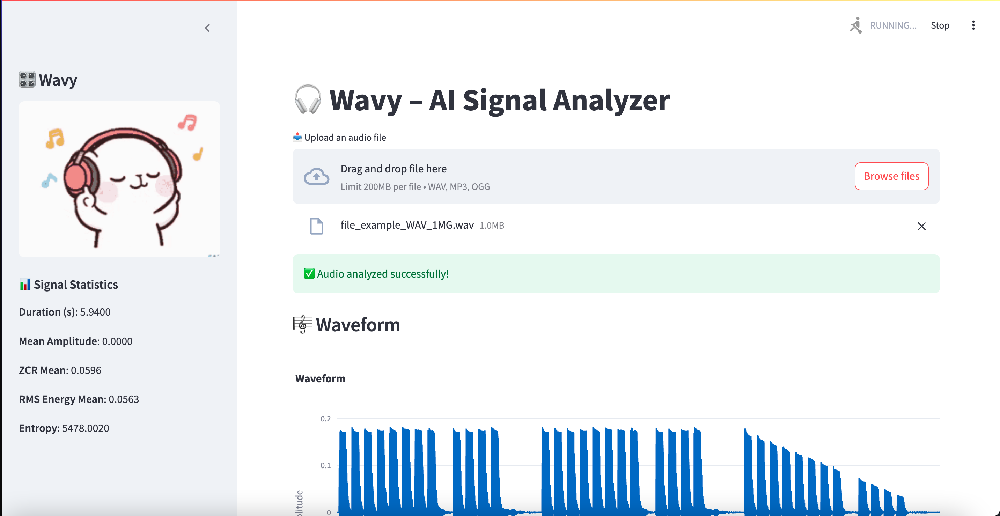
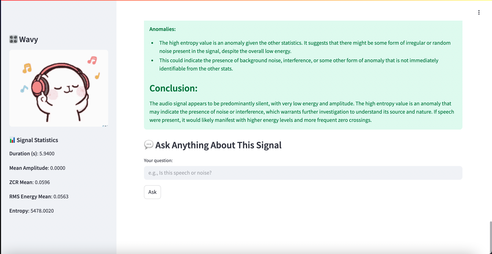
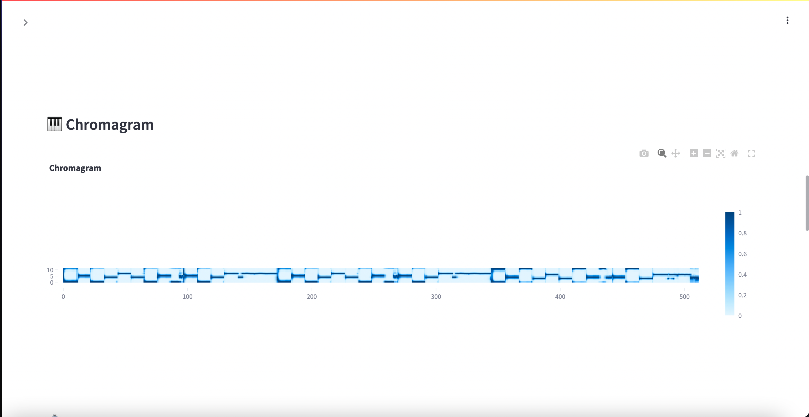

# 🎧 Wavy - Audio Signal Data Analysis tool with Mistral

Wavy is an interactive, AI-enhanced Streamlit app for analyzing audio signals with advanced visualizations and insights from a Large Language Model (LLM). Built for signal engineers, researchers, and audio enthusiasts, this tool automatically extracts key features and provides interpretive summaries.

---

## 🎯 Objective

The goal of **WaveLine** is to simplify and enrich the experience of analyzing audio signals, particularly for:

- Signal processing engineers
- Machine learning researchers
- Audio classification tasks
- Data annotation and diagnostics
- Rapid exploratory data analysis (EDA)

It combines the best of traditional signal analysis with modern AI assistance.

---

## 🚀 Features

**Visual Signal Analysis**  
  - Waveform (Oscillogram)
  - Mel Spectrogram  
  - MFCC Heatmap  
  - Chromagram  
  - Tempogram  
  - ZCR & RMS Energy Plots  
  - Power Spectral Density  

🧠 **Mistral LLM Insights**  
  Automatically generate expert-level summaries and interpretations from extracted signal statistics.

💬 **Signal Q&A Chatbot**  
  Ask questions about your audio — the bot leverages your visualizations and statistics.

---

## 🧠 Methodology

### 1. **User Upload**
- Users upload an audio file (WAV, MP3, or OGG).
- The app reads it in memory using `librosa` or `soundfile`.

### 2. **Signal Feature Extraction**
Using traditional signal processing techniques, we compute:
- **Waveform**: Raw audio signal
- **Spectrogram**: Frequency over time
- **MFCCs**: Mel-Frequency Cepstral Coefficients, often used in speech recognition
- **Zero Crossing Rate (ZCR)** and **Root Mean Square (RMS)**: For silence/speech segmentation
- **Pitch Contour**: Using YIN algorithm for voicing
- **Chromagram**: Harmonic content and notes
- **Tempogram**: Beat and rhythm representation
- **Power Spectral Density (PSD)**: For dominant frequency analysis
- **Wavelet Scalogram**: Multiscale frequency detail via Continuous Wavelet Transform (CWT)

### 3. **LLM-Based Signal Insight**
- Extracted features are summarized into statistical descriptors (mean, std, skewness, kurtosis, entropy).
- These descriptors are sent to **Mistral**, a lightweight LLM, to generate an expert-like interpretation:
  > _"The audio contains moderate energy with a slightly skewed distribution indicating sudden bursts of sound..."_

### 4. **Chatbot Interface**
- Users can chat with an agent to ask questions like:
  > _"Is there speech in this audio?"_  
  > _"What frequency components dominate?"_  
  > _"How rhythmic is this signal?"_

  The bot uses the same stats and visual context to provide informed responses.

---


## 🛠️ Setup & Run Locally

### 1. Clone the Repo

```
git clone https://github.com/Maria-Antony/Wavy

```
### 2. MISTRAL API KEY

Add your Mistral API Key using a .env file

### 3. Install Dependencies
```
pip install -r requirements.txt
```

### 4. Run the App

```
streamlit run app.py
```
---

## 📈 Demo Pics

Once uploaded, the app provides:

- 📈 Interactive plots using **Plotly**
- 📊 Sidebar summary of key signal statistics
- 🧠 **LLM-based interpretation** of signal behavior
- 💬 A **chat panel** for signal-level Q&A

Everything is wrapped in a modern and intuitive **Streamlit dashboard**.





---

## 💡 Future Plans

- 🎤 Real-time microphone input
- 📁 Batch audio analysis
- 🧠 Custom model hosting via Hugging Face Inference Endpoints
- 🎓 Auto-tagging for supervised ML
- 📄 PDF/CSV report generation

---

